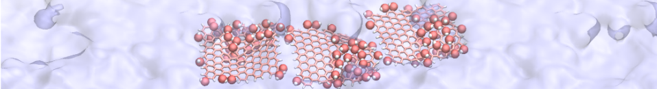

# Adsorption of graphene oxide nanoparticles at the water vapor interface

This scipts can be used to measure the free energy profile of a GO nanoparticle at the interface between water and vapor.

## Step 1. LAMMPS input file generation

Go in the consruction folder and run GenerateData.m using Matlab. It may also work with Octave. You can select a different graphene oxide nanoparticle from this [bank of nanoparticle](https://github.com/simongravelle/GrapheneOxideNanoparticle). It will create 29 folders and 29 input files, all corresponding to a different initial position for the GO nanoparticle.

## Step 2. Run lammps

Run the input.lammps in all 29 folders using LAMMPS software. If you are new to LAMMPS, you can find [tutorials here](https://lammpstutorials.github.io/) that include help for free energy calculation.

## Step 3. Run the wham algorithm

To extract the positions of the particles from the generated data, run the wham algorithm from the Wham folder:

./wham -28 28 45 1e-8 300 0 metadata.dat PMF.dat 5 455878

The PMF file contains the free energy profile along the z axis across the interface. The wham algorithm is from [GROSSFIELD lab](http://membrane.urmc.rochester.edu/?page_id=126)

If you use this work, please cite:
[Gravelle S.](https://simongravelle.github.io/) and [Botto L.](https://bottogroup.wordpress.com/), [Adsorption of single and multiple graphene oxide nanoparticles at a water-vapor interface, Langmuir](https://pubs.acs.org/doi/10.1021/acs.langmuir.1c01902)
